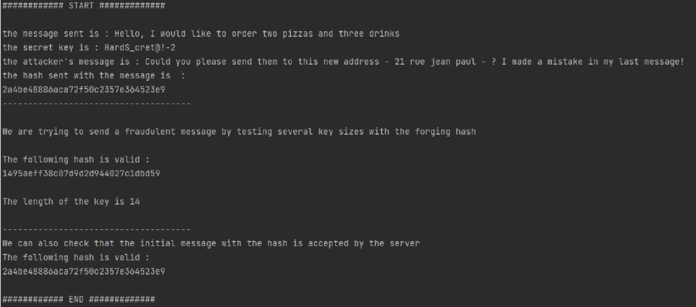

# lengthAttack

* **More details in the pdf report**

The length attack is an attack that takes place in several contexts: 

* two people exchange information 
* one person downloads content

In all situations, the person receiving the information wants to make sure that the message he receives has not been corrupted. For this, the encryption hash is sent and a secret key is shared. The attack allows to corrupt the message without having access to the secret key and still have a valid hash for the corrupted message. 

There are many length extension attacks. Indeed, it depends on the configuration in which we
place ourselves. What data is accessible to the attacker etc... Firstly, we will use the MD5 padding which is the following :

The padding consists in completing the string until its length is congruent to 56 bytes (mod 64). The remaining 8 bytes are kept for the size of the encoded length field.
So for my attack I chose the following configuration :

There are three actors, an operator, a server and an attacker.

The operator wants to send a message to a server and he wants the server to be able to verify
the authenticity of the message. The operator therefore also sends the hash of the message so
that the server can compare and is sure to receive the authentic message. To do this, the server will calculate the hash of the message and if the hash is authentic then the server can assume that the message is also authentic.

example : 

* message sent :

Hello, I would like to order two pizzas and three drinks for bugers ! My adress is one the main street 1 floor ! thank you in, see U

* message after modification :

Hello, I would like to order two pizzas and three drinks for bugers ! My adress is one the main street 1 floor ! thank you in, see U. Could you please send them to this new address - 21 rue jean paul - ? I made a mistake in my last message!

The server then accept the malicious message

## Requirements
For this project I used the openssl library and used the openssl/md5.h package

## Run 

How to run ?

* `gcc main.c lengthAttack.c -o main.exe -lcrypto`
* `.\main.exe`

You want to try ?

* in `main.c` change :
    * `key` : secret key (could be whatever you want) 
    * `received_message ` : message sent (what should receive the server) 
    * `attacker_message ` : message malicious added to the `received_message` 

## Warning
**When changing the messages or keys, it is necessary to keep the '\0' at the end
It can work without but just to be sure !**